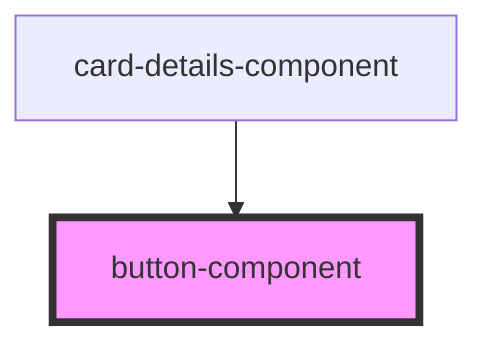

# button-component

<!-- Auto Generated Below -->

## Properties

| Property | Attribute | Description | Type  | Default     |
| -------- | --------- | ----------- | ----- | ----------- |
| `data`   | `data`    |             | `any` | `undefined` |

## Events

| Event        | Description | Type                  |
| ------------ | ----------- | --------------------- |
| `onBtnClick` |             | `CustomEvent<string>` |

## Dependencies

### Used by

 - [card-details-component](../card-detail)

### Graph

----------------------------------------------

*Built with [StencilJS](https://stenciljs.com/)*
