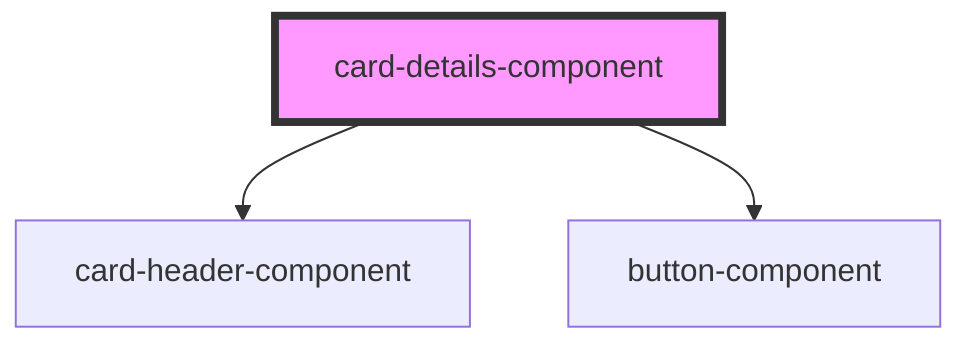

# card-details-component

<!-- Auto Generated Below -->

## Properties

| Property      | Attribute      | Description | Type  | Default     |
| ------------- | -------------- | ----------- | ----- | ----------- |
| `detailsData` | `details-data` |             | `any` | `undefined` |

## Dependencies

### Depends on

- [card-header-component](../card-header)
- [button-component](../button-component)

### Graph

----------------------------------------------

*Built with [StencilJS](https://stenciljs.com/)*
