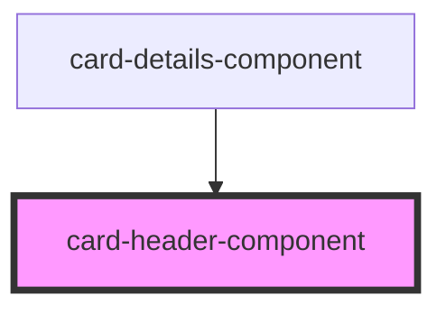

# card-header-component

<!-- Auto Generated Below -->

## Properties

| Property          | Attribute           | Description | Type     | Default     |
| ----------------- | ------------------- | ----------- | -------- | ----------- |
| `headingTitle`    | `heading-title`     |             | `string` | `undefined` |
| `headingTitleTag` | `heading-title-tag` |             | `string` | `undefined` |
| `headingType`     | `heading-type`      |             | `string` | `undefined` |

## Dependencies

### Used by

 - [card-details-component](../card-detail)

### Graph

----------------------------------------------

*Built with [StencilJS](https://stenciljs.com/)*
